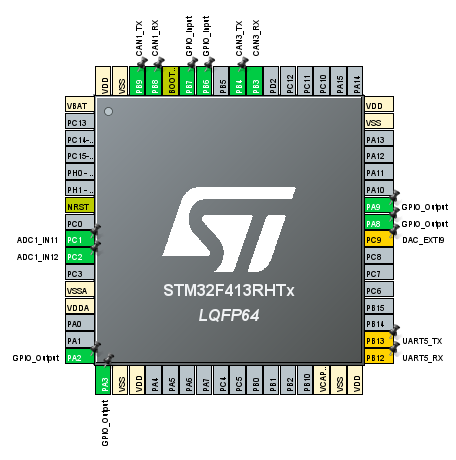

# VehicleControlUnit
Vehicle Control Unit (VCU) for the 2026 Longhorn Racing Solar car




## Getting Started

### Cloning
Clone this repository using the following command
``` sh
git clone git@github.com:lhr-solar/PS-VehicleControlUnit.git --recursive
```

### Installation
Follow the installation instructions for your specific platform, found [here](https://lhrsolar.org/Embedded-Sharepoint/Installation/).  

Additionally, install the [Arduino IDE](https://docs.arduino.cc/software/ide/)

## Command Usage

### Firmware build and flash

Firmware builds use [Embedded-Sharepoint](Firmware/Embedded-Sharepoint) from `Firmware/Makefile`. Enter the nix shell first, then run all commands from `Firmware/`.

By default, **`FIRMWARE_TYPE=app`**: the image is linked for the resident UART bootloader (application region at `0x08010000`, 512 KB part with 64 KB bootloader). Full protocol, one-time bootloader programming, and host scripts: [UART Bootloader](Firmware/Embedded-Sharepoint/docs/UartBootloader.md). USART3 on PC10/PC11 matches the default bootloader UART on STM32G473.

**Nix shell (repository root):**

```sh
chmod +x ./run_nix.sh   # first time only
./run_nix.sh
cd Firmware
```

**Clean** (removes both `Firmware/build` and `Firmware/build/app`):

```sh
make clean
```

**Bootloader application (default)** — output under `Firmware/build/app`:

```sh
make
make flash
make flash-uart
```

**Standalone firmware** at `0x08000000` (no resident bootloader) — output under `Firmware/build`:

```sh
make clean
make FIRMWARE_TYPE=firmware
make flash FIRMWARE_TYPE=firmware
make flash-uart FIRMWARE_TYPE=firmware
```

When switching between `app` and `firmware`, run **`make clean`** first so linker maps and objects stay consistent.

**Other makefile variables:**

```sh
make PROJECT_TARGET=stm32g473xx    # default; override if you change MCU port
make NODAWG=1                      # optional macro for this repo
```

### Compiling tests

Tests live in `Firmware/tests/` and must be named `test_<name>.c`; the `test_` prefix and `.c` suffix are omitted from `TEST`.

```sh
make TEST=<name>
```

Example (`Firmware/tests/blinky_test.c`):

```sh
make TEST=blinky
make flash
```

To build a test image as standalone instead of the default bootloader app:

```sh
make clean
make TEST=blinky FIRMWARE_TYPE=firmware
make flash FIRMWARE_TYPE=firmware
```
